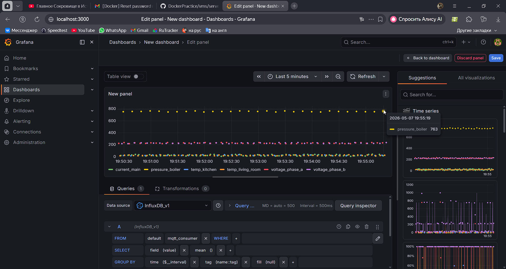

# Отчет по лабораторной работе: Docker

## 1. Настройка брокера сообщений (Фаза 1)
Был успешно запущен MQTT-брокер Eclipse Mosquitto на центральной виртуальной машине (Gateway). Брокер принимает данные от датчиков и передает их серверу аналитики.

**Успешный запуск контейнера Mosquitto:**
.png)

## 2. Запуск симулятора датчиков (Фаза 2)
Был написан код для генерации данных температуры, давления, напряжения и тока. В формулу добавлен месяц рождения (8) для уникальности значений. Был написан `Dockerfile` и `docker-compose.yml` для поднятия 6 контейнеров (датчиков).

**Успешная сборка и запуск 6 контейнеров на клиенте:**
.png)

**Логи работы датчика (успешная отправка данных в брокер):**
.png)

## 3. Публикация образа на Docker Hub
Собранный Docker-образ симулятора датчиков был успешно переименован (тегирован) и отправлен в публичный репозиторий Docker Hub.

**Опубликованный образ на Docker Hub:**
.png)

## 4. Развертывание инфраструктуры аналитики (Фаза 3)
На серверной виртуальной машине были запущены база данных InfluxDB, сборщик метрик Telegraf и система визуализации Grafana через `docker-compose`. Была настроена маршрутизация через внутреннюю сеть Docker (`server-net`).

**Успешное скачивание и запуск инфраструктуры:**
.png)

## 5. Визуализация метрик в Grafana
Был создан дашборд, который автоматически подключается к базе данных InfluxDB (через механизм Provisioning) и отрисовывает графики со всех 6 датчиков в реальном времени.

**Финальный дашборд умного дома:**

---

# Инструкция по развертыванию (Manual)

Данное руководство описывает процесс запуска комплекса из трех узлов (Broker, Analytics, Simulator) на машинах проверяющего.

## Предварительные требования
* Установленный `docker` и `docker-compose`.
* Свободные порты: `1883` (Mosquitto), `8086` (InfluxDB), `3000` (Grafana).

## Шаг 1. Запуск MQTT Брокера (Gateway)
Перейдите в папку шлюза и запустите брокер:
    
    cd vms/gateway/mosquitto
    docker run -d -v $PWD/config:/mosquitto/config -p 1883:1883 --name broker --restart always eclipse-mosquitto

## Шаг 2. Запуск Сервера Аналитики (Server)
Перейдите в папку сервера аналитики и поднимите инфраструктуру:

    cd vms/server
    docker-compose up -d

*(Контейнеры InfluxDB, Telegraf и Grafana поднимутся в собственной сети `server-net`. Дашборды подтянутся автоматически через механизм Provisioning).*

## Шаг 3. Запуск Симулятора Датчиков (Client)
Перейдите в папку симулятора и запустите генерацию данных (образ будет скачан с Docker Hub `ministerski/sensor-sim:latest`):

    cd vms/client/simulator
    docker-compose up -d

## Шаг 4. Проверка результата
1. Откройте браузер и перейдите по адресу: `http://localhost:3000` (или IP вашей машины).
2. Авторизуйтесь: логин `admin`, пароль `admin`.
3. Перейдите в раздел **Dashboards** -> выберите **Sensors**. 
4. Вы увидите график с потоком агрегированных данных по 6 датчикам в реальном времени.

Для остановки среды выполните `docker-compose down` в соответствующих папках.
